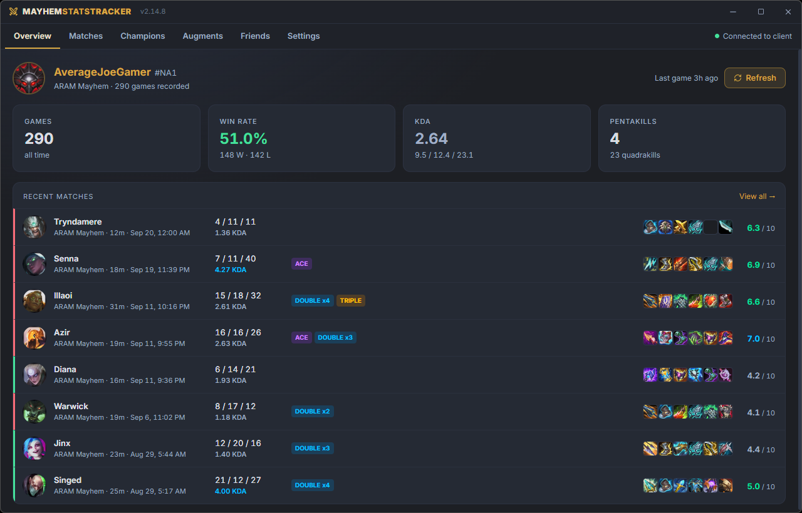
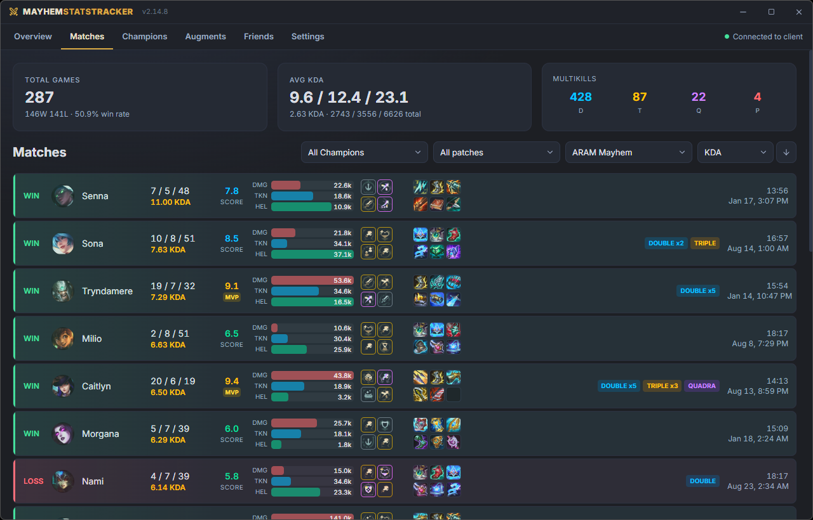
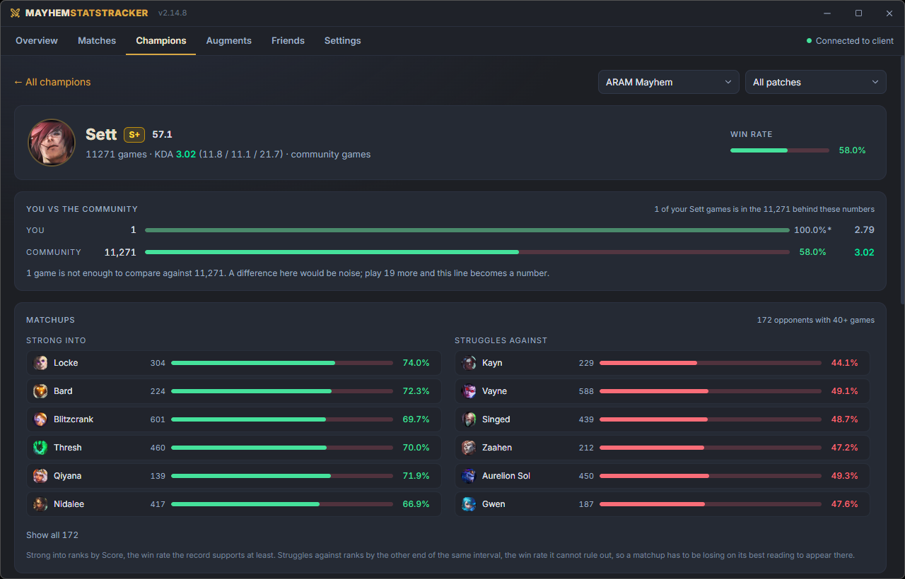
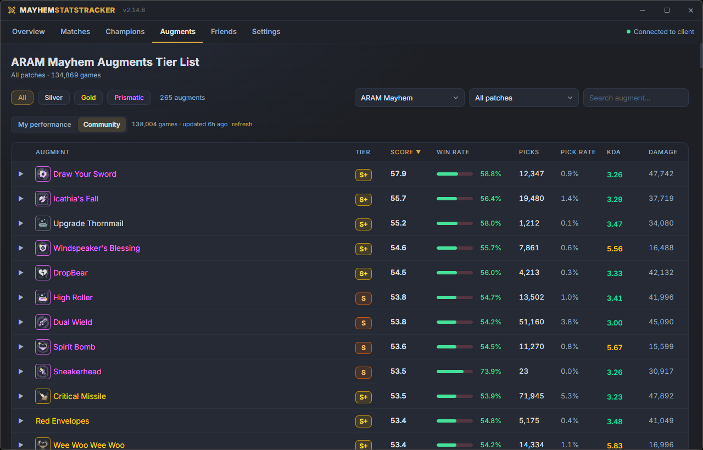
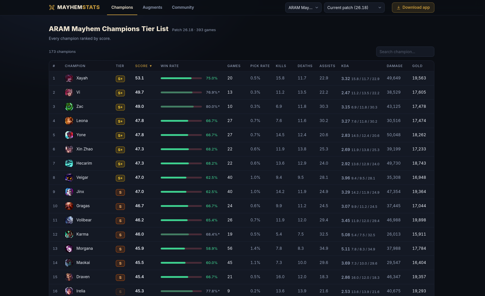
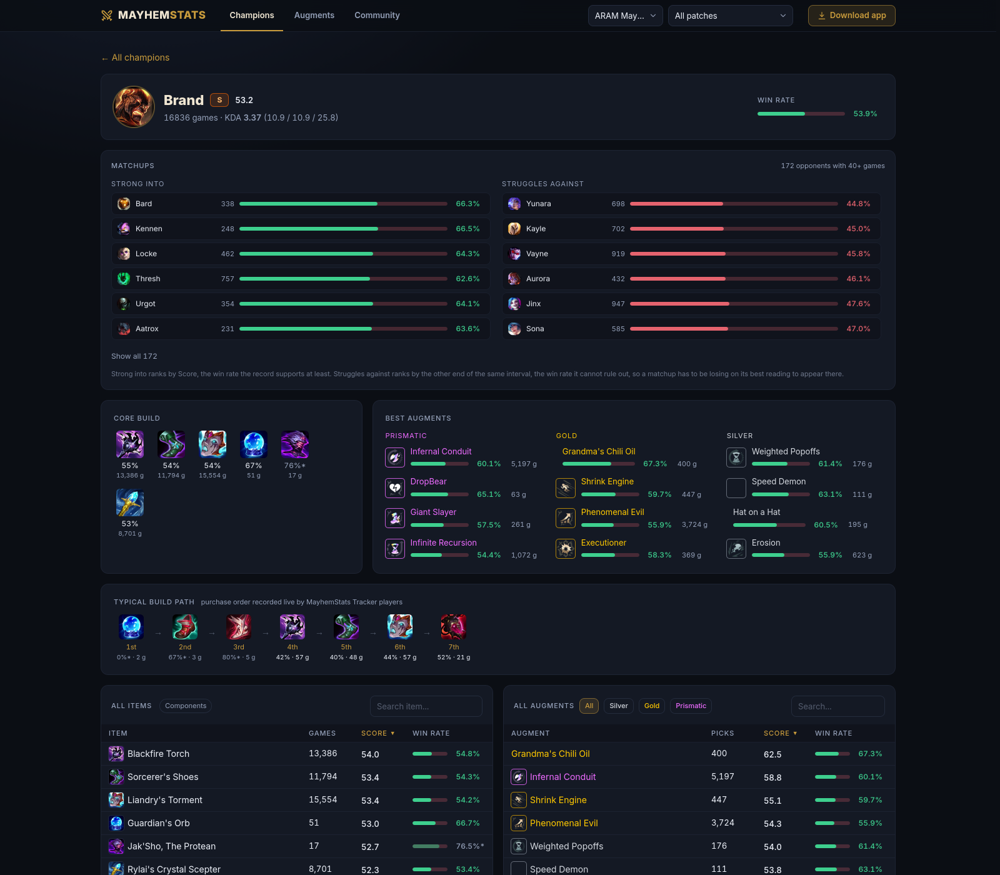
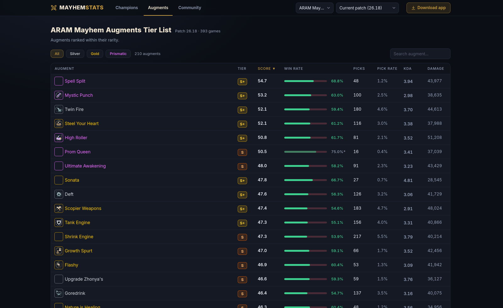

# MayhemStats Tracker

Desktop app for tracking ARAM Mayhem match history in League of Legends. It connects to the League Client (LCU) and records your matches automatically - and, if you opt in, contributes them **anonymously** to the community database behind the public stats site:

**[MayhemStats.com](https://mayhemstats.com/)** - augment and champion tier lists, win rates, matchups and per-champion ideal builds, built from a one-time seed of match histories at launch and the games players running this app have contributed since. The seed is described on the site's [privacy page](https://mayhemstats.com/privacy/#seed).

## Why this exists

Riot's public API doesn't expose ARAM Mayhem's match data - augment picks, in
particular, never appear in Match-V5. The big stats sites work around the gap
with proxy data: item stats borrowed from regular ARAM and augment stats
borrowed from Arena. Those are different modes with different balance, pacing,
and augment pools - **nobody's numbers actually come from Mayhem games**.

The one place real Mayhem data exists is the League client itself, which holds
the full post-game breakdown of your own matches. So this project crowdsources
it: the tracker reads your matches from your own client, and players who opt
in pool anonymized copies into a shared database. Every win rate and ideal
build on [MayhemStats.com](https://mayhemstats.com/) comes from actual ARAM
Mayhem games - read from the client, because there is no other source.

## What's in the app

**Overview** - your record at a glance: games, win rate, KDA, multikills, and your recent matches.



**Matches** - every game you've played, filterable by champion, patch and queue. Each row carries the full scoreboard: KDA, a per-game score, the items and augments you took, damage dealt, taken and healed, and any multikills.



**Champions** - the tier list, from S+ to D, ranked by Score with win rate, games, pick rate, KDA, damage and gold. A switch at the top flips the whole board between **your** games and the **community's**.

**Champion pages** - tier and Score, a **You vs the community** line putting your record on that champion next to everyone else's, **matchups** (who it beats, who beats it), the **core build**, the **best augments** split by rarity, the **typical build path** in purchase order, and full sortable item and augment tables.



**Augments** - the augment tier list, filterable by rarity. Expand any row to see the champions it performs best on and which augments it pairs well with.



**In game** - while a game is running, a tab appears with the augment board for the champion you're playing, split by rarity, with the augments you've already taken struck off. Under it sits the core build for that champion, reading your actual inventory so bought items move out of the recommendation and what's left is what you can still buy.

**Friends** - per-teammate records drawn from the games you played together.

**Settings** - community sharing, one-off history backfill, export and import, tray and startup behaviour, and a button that deletes everything you've ever contributed.

## What's on the site

Everything the community pool knows, without installing anything. [MayhemStats.com](https://mayhemstats.com/) carries the same boards, the same champion pages and the same scoring as the app, because both surfaces import them from [`src/shared/`](src/shared/).

### Champion tier list



### Champion pages

Matchups, core build, best augments by rarity, the typical build path recorded live by tracker players, and the full item and augment tables.



### Augment tier list



## How the numbers work

Everything ranks by **Score**, which is the lower bound of a 95% Wilson interval on the win rate: read it as "the win rate this record supports". A perfect 5-0 scores 56.6, because five games cannot rule out a coin flip. Sample size moves the number on its own, so an entry climbs as it proves itself rather than arriving at the top and sliding down.

**Tiers** are a rank within a cohort - all champions, or all augments of one rarity - so the current meta always has an S+ and a D. Entries marked `*` fall under 20 games and should be read as directional.

The maths lives in [`src/shared/score.ts`](src/shared/score.ts) and is held to the figures the site publishes by [`test/stats.test.mts`](test/stats.test.mts).

## Download

Grab `MayhemTracker-Setup.exe` (installer) or `MayhemTracker-Portable.exe` (no install, runs anywhere) from [mayhemstats.com/download](https://mayhemstats.com/download/) or the [latest release](https://github.com/MyNamesEMurray/mayhem-tracker/releases/latest). The app checks for updates automatically.

## Code signing policy

MayhemStats Tracker uses the [SignPath Foundation](https://signpath.org/) for code signing of its Windows releases. Free code signing provided by [SignPath.io](https://about.signpath.io/), certificate by SignPath Foundation. _(Certificate pending - releases published before it is issued are unsigned, so Windows SmartScreen will warn on first run.)_

Every release is built by [GitHub Actions](.github/workflows/release.yml) from the source in this repository, on GitHub-hosted runners, and submitted to SignPath from that same workflow run. Nothing is built or signed on anyone's machine.

**Team roles**

- Committers and reviewers: [MyNamesEMurray](https://github.com/MyNamesEMurray) - the only account with write access to this repository. Pull requests from anyone else are reviewed before merging.
- Approvers: [MyNamesEMurray](https://github.com/MyNamesEMurray) - every signing request is approved by hand in SignPath before a release is signed.

**Privacy policy**

This program will not transfer any information to other networked systems unless specifically requested by the user or the person installing or operating it. In practice that means: the app talks to your own League client on localhost, checks GitHub for updates, and loads champion, augment, and item data from Riot's public Data Dragon CDN. It uploads match records to the community database only if you switch on **Settings → Community Stats**, which is off by default. The full [privacy policy](https://mayhemstats.com/privacy/) covers exactly what an upload contains and how to delete your contributions.

## Community stats & privacy

Contributing is **off by default**. Flip it on in **Settings → Community Stats**, and after each game (plus your existing history, once) the app uploads an anonymous record of the match.

**What an upload contains**, for each of the ten players in a game: champion, augments, items, and combat stat lines (kills/deaths/assists, damage, healing, gold, multikills), plus the match's queue, patch, duration, and region + game id (so the same game uploaded by two players is only counted once).

**What is never uploaded**: summoner names, Riot IDs, tag lines, profile icons, puuids, or anything else that identifies a player. The server's database schema has no columns for identity data, and the public website can only read aggregate views (counts grouped by patch/queue/champion/augment) - never individual games.

Uploads are tied to a random token generated on your machine (not derived from any account data) so abuse can be rate-limited, and **Settings → Delete my contributions** removes everything you've shared at any time. Games no one else contributed are deleted entirely.

## Tech Stack

Electron + React + TypeScript, built with electron-vite. Uses Tailwind CSS for styling, better-sqlite3 for local storage, and league-connect for LCU integration. The community backend is Supabase (Postgres, materialized-view rollups and edge functions) and the website is a static Vite app in [`website/`](website/). Both surfaces import their scoring, formatting and design tokens from [`src/shared/`](src/shared/), so a number or a colour cannot mean one thing in the app and another on the site.

## Development

Requires Node.js 22.12 or newer.

```bash
npm install       # also rebuilds native modules for Electron (postinstall)
npm run dev       # start in dev mode
npm test          # scoring, formatting and shared-UI tests
npm run typecheck # app, website and test projects
```

## Build

```bash
npm run dist      # build Windows portable executable
```

## Credits

Forked from [Yhprum/mayhem-tracker](https://github.com/Yhprum/mayhem-tracker) - the original tracker this community edition builds on.

## Disclaimer

MayhemStats Tracker was created under Riot Games' "Legal Jibber Jabber" policy using assets owned by Riot Games. Riot Games does not endorse or sponsor this project.
